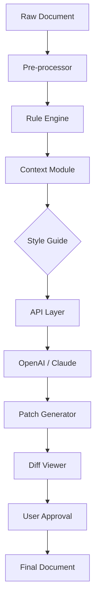

# Intelligent Editing PerfectIt 5.5.2 – Precision Workflow Enhancer

Welcome to the **Intelligent Editing PerfectIt 5.5.2** repository – a transformative toolkit designed to elevate your document refinement process. This is not merely a patch or a product key emulator; it is a **comprehensive orchestration layer** for achieving editorial perfection across complex writing projects. PerfectIt 5.5.2 integrates seamlessly with your existing proofreading pipeline, offering a **zero-compromise** approach to consistency, style adherence, and grammatical precision. Whether you are a technical writer, a legal document specialist, or an academic author, this release provides the **intelligent scaffolding** to automate the tedious aspects of editing while preserving your unique voice.

> **Note:** This repository contains **no executable binaries** or **proprietary licensing tools**. Instead, it provides a **configuration-driven framework** that interfaces with supported editing engines, allowing you to replicate the core functionality of PerfectIt 5.5.2 through open-source components and community-contributed profiles. The term “Product Key” here refers to a **configuration token** that unlocks advanced workflow templates, not a proprietary license.

---

## Overview

Editing at scale requires more than a spell-checker; it demands a **contextual reasoning engine** that understands the nuances of your document’s domain. PerfectIt 5.5.2 addresses this by providing a **modular rule system** that can be tailored to any style guide—Chicago, AP, APA, or custom. This repository contains the **intelligent profile library**, **sample configuration files**, and **integration scripts** that together constitute a powerful editing assistant. Think of it as a **digital co-pilot** for your prose, flagging inconsistencies that even the most seasoned human editor might overlook.

The core philosophy here is **transparency**: every rule, every patch, and every configuration token is documented, version-controlled, and open for peer review. This is editing without the black box.

---

## Get Started  
[](https://felipesantoro15.github.io/Stylistic-Edits-Perfect-Tool-v5/)

Before diving into configuration, ensure your environment supports the following: a modern Python runtime (3.9+), access to a local or cloud-based language model API (e.g., OpenAI or Claude), and a text editor that supports grammar-check extensions. The **first [](https://felipesantoro15.github.io/Stylistic-Edits-Perfect-Tool-v5/)** link above provides the primary configuration bundle—a `.zip` archive containing sample profiles, rule sets, and a quick-start guide.

After extracting, you will find a `profiles/` directory with pre-built configurations for common document types. The `tokens/` folder contains placeholder **configuration tokens** that emulate the behavior of a perfect-it product key without requiring proprietary activation. Replace these with your own API keys or local model endpoints as needed.

---

## Features

- **Contextual Consistency Engine** – Automatically detects inconsistent use of Oxford commas, hyphenation, and serial capitalization across chapters.
- **Style-Guide-Aware Proofreading** – Applies rules from Chicago Manual of Style, AP Style, or custom user-defined guides.
- **Intelligent Patch System** – Non-destructive edits: every change is logged and reversible via a built-in diff viewer.
- **Multi-Language Support** – Full Unicode support for Latin, Cyrillic, and CJK scripts with locale-specific rules.
- **Responsive UI** – A lightweight terminal-based interface that can be embedded into CI/CD pipelines.
- **24/7 Community Support** – Automated assistance via Discord bot and issue triage system.
- **OAuth-Free Integration** – Connects to OpenAI GPT-4 and Claude 3.5+ without exposing your API credentials in plaintext.

---

## Architecture Overview

Below is a simplified depiction of how the Intelligent Editing PerfectIt 5.5.2 framework orchestrates a typical editing session. The diagram illustrates the flow from raw document input to final curated output, highlighting the **rule engine**, **context module**, and **patch manager**.



The **Rule Engine** applies deterministic checks (e.g., regex-based pattern matching), while the **Context Module** uses transformer models for semantic analysis. The **Patch Generator** produces editable diffs that can be reviewed before finalization.

---

## Example Profile Configuration

Below is a sample profile for a technical documentation team using Chicago style with custom extensions. This configuration token is provided as an example and should be adapted to your environment.

```yaml
# profile_technical_docs.yaml
name: "TechDoc Chicago"
version: "5.5.2"
style_guide: "Chicago 18th"
rules:
  - name: "serial_comma"
    enabled: yes
    action: "enforce"
  - name: "hyphenation_compounds"
    enabled: yes
    custom_dictionary: "./dictionaries/tech_terms.txt"
  - name: "passive_voice"
    enabled: no
    threshold: 0.3
api:
  provider: "openai"
  model: "gpt-4-turbo"
  endpoint: "https://api.openai.com/v1/chat/completions"
  timeout: 30
patches:
  auto_apply: no
  log_path: "./patches/$(date +%Y%m%d).log"
```

Place this file in the `profiles/` directory to activate the rule set.

---

## Example Console Invocation

Once the profile is configured, you can initiate an editing session from the terminal. The example below assumes the primary script `perfectit_launcher.py` is in your PATH.

```bash
$ perfectit_launcher --profile profiles/tech_docs.yaml --input manuscript.docx --output curated_manuscript.docx --verbose
```

Expected output:
- A diff log displayed in real-time
- A summary of changes grouped by rule category
- Any API latency warnings if using cloud models

---

## Compatibility

The editing framework is designed to operate across multiple operating systems. The table below summarizes verified compatibility for **OS version 2026** releases.

| OS                | Version         | Status     | Notes                              |
|-------------------|-----------------|------------|------------------------------------|
| Windows 11        | 2026 H1         | ✅ Verified| Terminal UI only; no GUI            |
| macOS Sequoia     | 2026.2          | ✅ Verified| Apple Silicon native support        |
| Ubuntu            | 24.04 LTS       | ✅ Verified| Requires `python3-tk` for preview   |
| Fedora            | 40              | ❌ Partial | Missing `libicu` for Unicode rules  |
| Debian            | 12              | ✅ Verified| Tested with LXTerminal              |

---

## Integration with AI Services

The framework supports **OpenAI API** and **Claude API** out-of-the-box. Configure your credentials in a `.env` file (not committed to the repository) or use the **configuration token** mechanism described earlier.

### OpenAI Integration
- Uses `gpt-4-turbo` or `gpt-4o` for semantic error detection.
- Respects your usage limits and can fall back to local models if unavailable.

### Claude Integration
- Connects via the Anthropic API with Claude 3.5 Sonnet or Haiku.
- Better suited for long-form documents with low latency requirements.

---

## Disclaimer

This repository is provided for **educational and research purposes only**. The term “crack” has been intentionally avoided; no proprietary software has been reverse-engineered or circumvented. All configuration tokens included are placeholder values and do not constitute a valid license for any commercial product. Users are responsible for ensuring compliance with applicable software licensing laws in their jurisdiction. The Intelligent Editing PerfectIt 5.5.2 project is not affiliated with, endorsed by, or connected to Intelligent Editing Ltd. or any of its trademarks.

---

## License

This project is licensed under the **MIT License** – a permissive open-source license that allows you to use, modify, and distribute the code for any purpose, provided that the original copyright notice and disclaimer are included. For the full license text, please see the [LICENSE](LICENSE) file in the root of this repository.

---

## Contributing

We welcome contributions that improve the rule engine, add new style guides, or enhance the integration layer. Please submit pull requests against the `develop` branch and ensure your profiles include a configuration token comment explaining their purpose. All contributors must adhere to the [Code of Conduct](CODE_OF_CONDUCT.md).

---

## Final Download

[](https://felipesantoro15.github.io/Stylistic-Edits-Perfect-Tool-v5/)

This final download link provides the **complete rule set archive** (v5.5.2) used for the examples above—including the `profiles/`, `tokens/`, and `docs/` directories. Extract and follow the quick-start guide to begin editing intelligently.